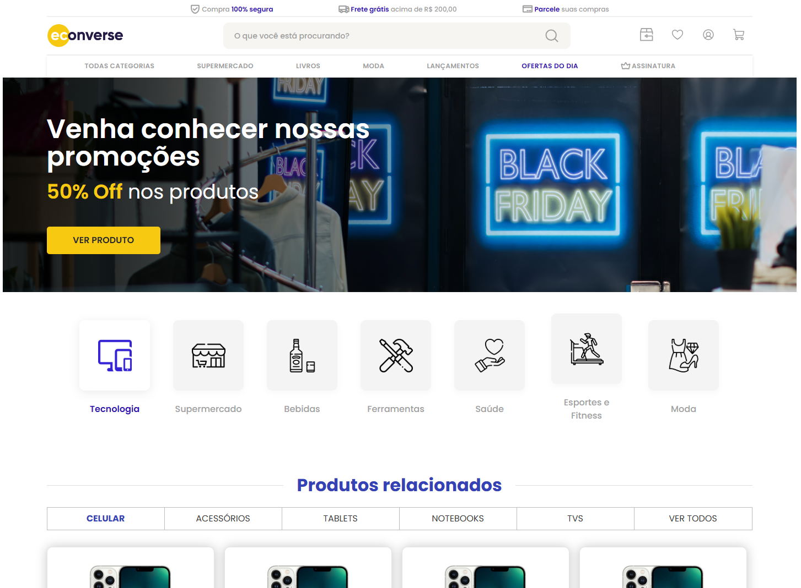

# Teste Front-End - Econverse

<p align="center">
  <a href="[COLE_AQUI_O_LINK_DO_SEU_PROJETO_ONLINE](https://devclub-institucional-front-end-teste-econverse.5scnjc.easypanel.host/)" target="_blank">
    
  </a>
</p>

Projeto desenvolvido em React, TypeScript e SCSS para o teste técnico da Econverse. Clique Aqui!👆

---

## Tecnologias

- **React 18** com **Vite**
- **TypeScript**
- **Sass (SCSS Modules)**
- **Axios**

---

## Funcionalidades

- **Vitrine de Produtos**: Consumo da API com Axios, tratamento de carregamento e erros.
- **Modal Interativo**: Preço calculado dinamicamente com base na quantidade (`+` / `-`).
- **Desconto de 5%**: Aplicado nos cards da vitrine e preço promocional mantido no banner.
- **Estilização Nativa**: Uso de `@mixin` e variáveis SCSS sem bibliotecas de UI externas.
- **HTML Semântico**: Estruturação limpa voltada para boas práticas e SEO.

---

## Como Rodar o Projeto

1. **Clone o repositório:**
  ```bash
  git clone https://github.com/Tiagliveira/teste-front-end.git
   ````
2. **Acessar o diretório do projeto**
  ```bash
   cd teste-front-end
   ````
3. **Instalar as dependências**
  ```bash
   npm install
  ````
4. **Configurar as Variáveis de Ambiente (.env)**
  
   Crie um arquivo chamado .env na raiz do projeto contendo a seguinte variável:
   Snippet de código
  ```bash
   VITE_API_URL=
(Obs: Uma cópia deste modelo está presente no arquivo .env.example).
   ````
5. **Executar a aplicação**
  ```bash
   npm run dev
   ````
  Abra o seu navegador e acesse a URL: http://localhost:5173
  
 ````bash
  📂 Estrutura de Pastas do Projeto
  Plaintext
  teste-front-end/
  ├── public/
  ├── src/
  │   ├── assets/              # Ícones SVG e imagens estáticas
  │   ├── components/          # Componentes React modularizados e isolados
  │   │   ├── Banner/
  │   │   ├── BrandList/
  │   │   ├── CarrouselProducts/
  │   │   ├── Categories/
  │   │   ├── Footer/
  │   │   ├── Header/
  │   │   ├── Modal/
  │   │   ├── Newsletter/
  │   │   ├── PartnerBanners/
  │   │   ├── ProductCard/
  │   │   └── ProductCarousel/
  │   ├── constants/           # Constantes estáticas e dados fixos
  │   ├── services/            # Serviços de integração com a API (Axios)
  │   ├── styles/              # SCSS global, variáveis e mixins
  │   │   ├── abstracts/
  │   │   │   ├── _mixins.scss
  │   │   │   └── _variables.scss
  │   │   └── global.scss
  │   ├── types/               # Definições de interfaces do TypeScript
  │   ├── App.tsx              # Componente principal da aplicação
  │   ├── main.tsx             # Ponto de entrada do React
  │   └── vite-env.d.ts        # Tipagem global do Vite para .env
  ├── .env.example
  ├── .gitignore
  ├── package.json
  ├── tsconfig.json
  ├── vite.config.ts           # Configuração de proxy e plugins do Vite
  └── README.md
````
 ##Desenvolvedor##
**Tiago de Oliveira Pereira**

Desenvolvedor Full Stack / Front-End

GitHub: [https://github.com/Tiagliveira](https://github.com/Tiagliveira)
